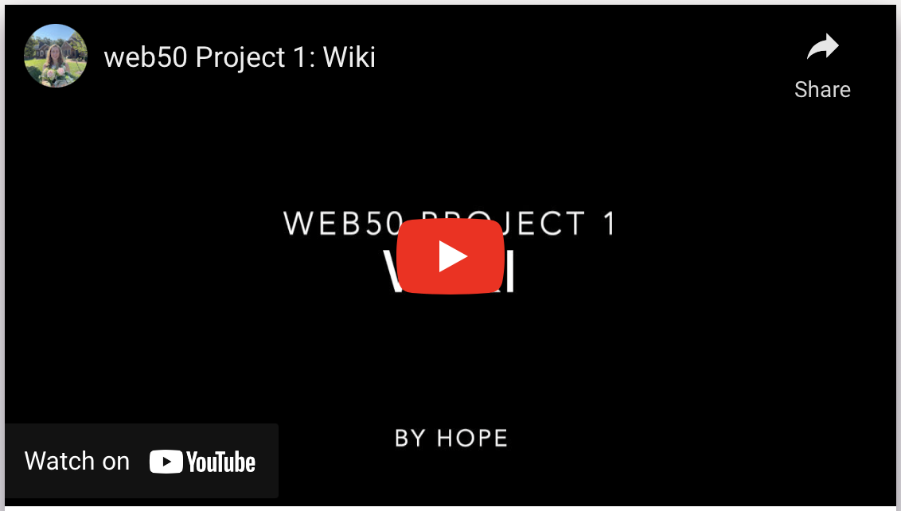

# Wiki

## Technologies
* Python
* Django
* HTML
* CSS
* Markdown conversion

## Summary
A Wikipedia-like website where users can upload and edit encyclopedia entries in Markdown. Users can create new entry topics, modify entries, and search for all entries that match a phrase. Markdown content (uploaded and modified by site users) is converted to HTML before being displayed.

## Video Demo

## How to Run
1. Clone this repository, navigate to the project and type the following commands:
2. Activate a virtual environment: 'python3 -m venv .venv' and select the virtual environment as the active workspace
3. Install dependencies: 'pip install -r requirements.txt'
4. Run the project: 'python3 manage.py runserver'

---

Starter code for this solo assignment provided by Harvard's CS50. You can read the full assignment description on [CS50's OpenCourseWare](https://cs50.harvard.edu/web/2020/projects/1/wiki/)